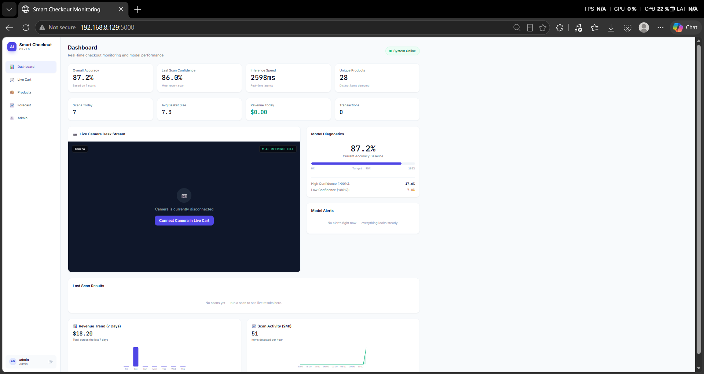
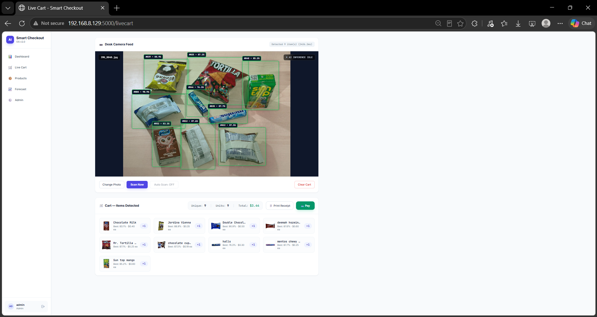
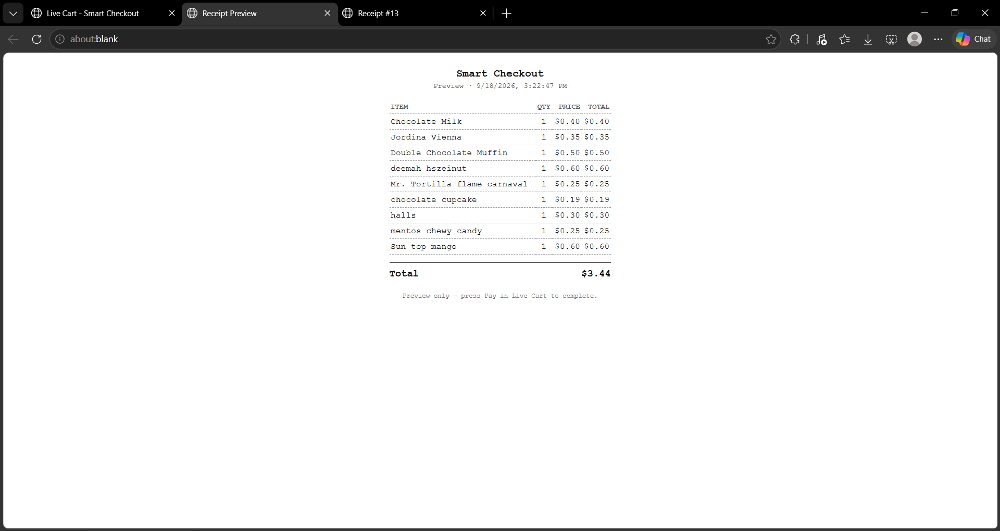
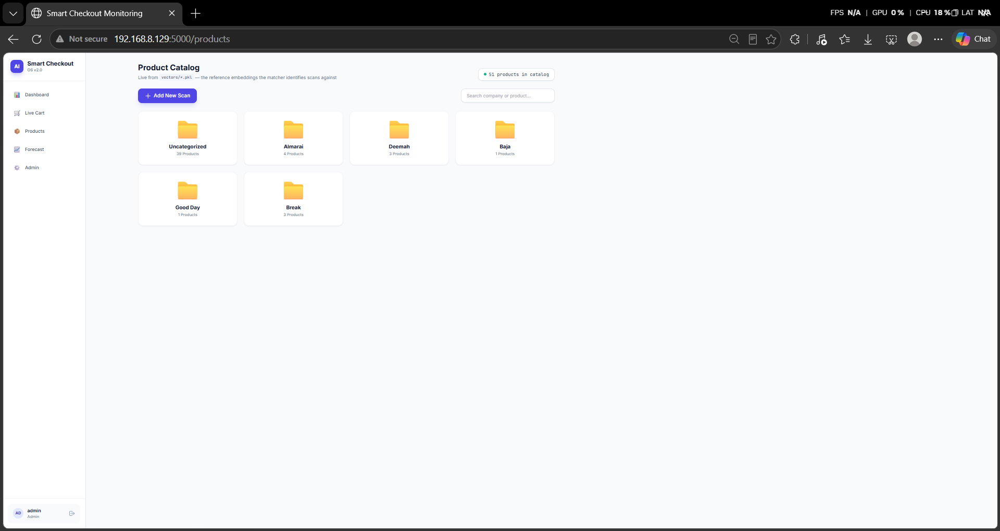
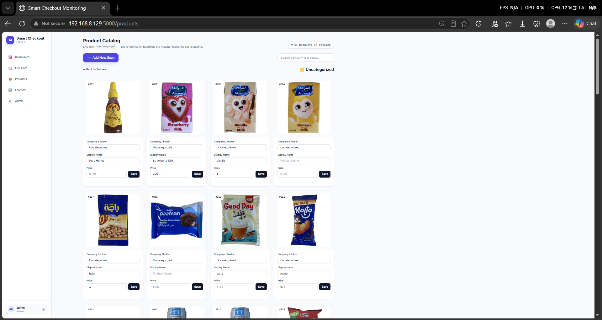
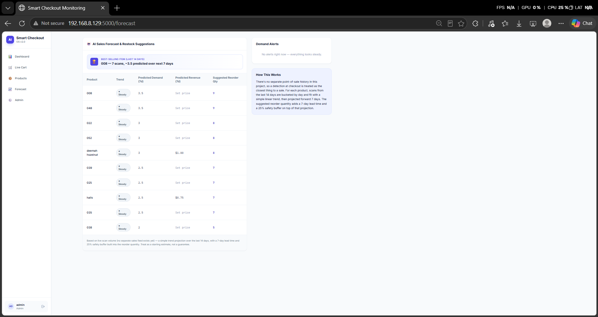
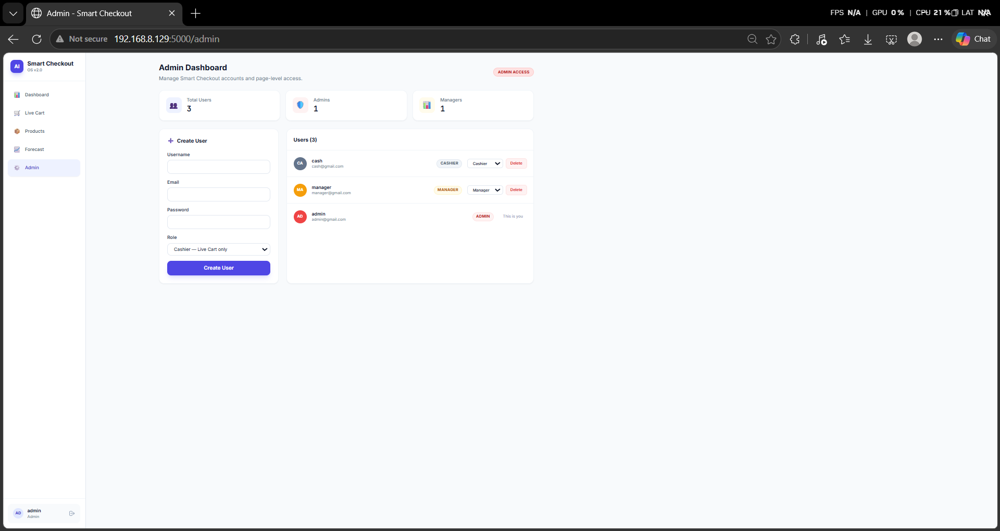
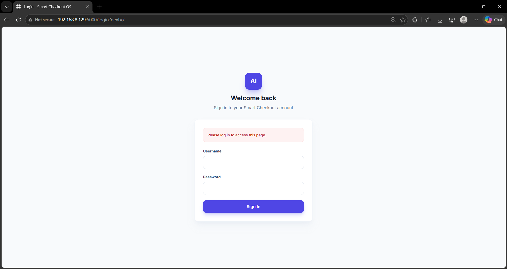

# Smart Checkout - AI-Powered Retail System

Smart Checkout is a computer vision-based retail checkout system designed to automate product identification. Instead of relying on manual barcode scanning, the system uses an overhead camera and a deep learning pipeline to detect, segment, and identify products placed on the checkout counter in real-time.

This project was built to explore the integration of AI models with a functional web backend to create a complete, end-to-end retail solution.

## Tech Stack
* **Computer Vision:** YOLO (Detection), MobileSAM (Segmentation), DINOv2 (Feature Extraction & Matching)
* **Backend:** Python, Flask
* **Database:** SQLite
* **Frontend:** HTML, CSS, JavaScript (Fetch API)

---

## System Overview

### 1. Dashboard & Monitoring
A central hub for store managers to monitor live checkout performance, system accuracy, and daily revenue.


### 2. Live Cart & Detection
The core of the system. The camera feed is processed in real-time. Products are detected, segmented, and matched against the catalog to build the customer's cart automatically.


Once the scan is complete, a digital receipt is generated with the calculated totals.


### 3. Product Catalog
Products are organized by brand for easy management and tracking.


Staff can add new products, update prices, and manage the reference images used by the AI model for matching.


### 4. AI Sales Forecast
A built-in forecasting tool that analyzes recent scan volumes to predict future demand and suggest restock quantities.


### 5. Role-Based Access Control
An admin panel to manage staff accounts, ensuring that cashiers, managers, and admins only have access to their respective modules.


### 6. Secure Authentication
A clean and secure login gateway verifying credentials and routing staff to their designated dashboards based on their assigned roles.


---

## How to Run (Installation & Setup)

### Prerequisites
To run the inference pipeline successfully, ensure the following files are present:
* `models/product_detector.pt` (Trained YOLO detector)
* `models/mobile_sam.pt` (MobileSAM segmenter)
* `vectors/001_vector.pkl ...` (Product catalog embeddings)

*Note: DINOv2 weights are pulled automatically by PyTorch Hub on the first run and cached locally.*

### Installation
Install the required dependencies using pip:
```bash
pip install flask ultralytics torch torchvision opencv-python pillow numpy
```
### Running the System
```
python app.py
```

### API Endpoint Usage
```
curl -X POST -F "image=@test.jpg" http://localhost:5000/predict
```

### Example JSON Response:
```
{
  "count": 2,
  "products": [
    {"bbox": [10, 20, 150, 200], "product": "003", "confidence": 0.87},
    {"bbox": [200, 50, 300, 250], "product": "011", "confidence": 0.71}
  ]
}
```
